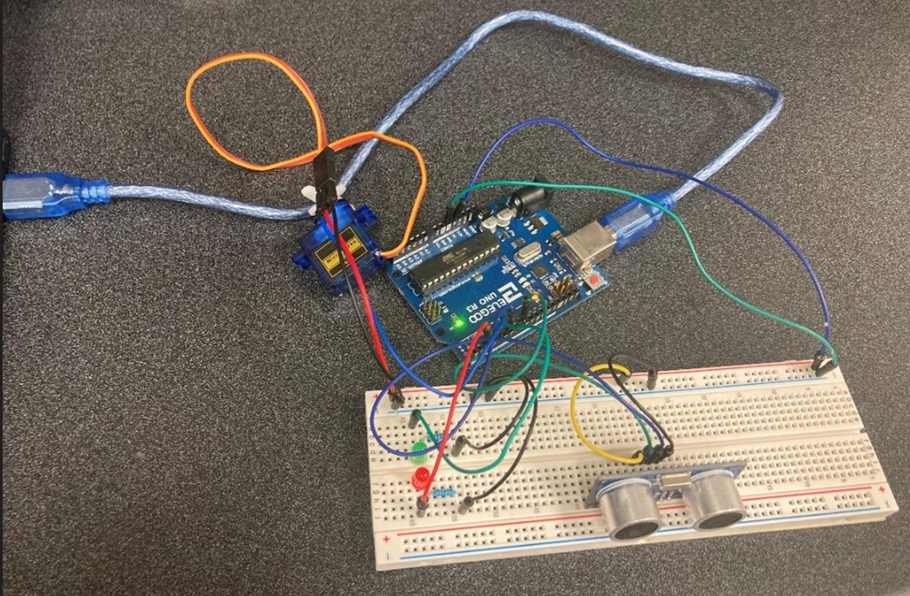

# HeartBeat-Tracking
A demo for implementing a heartbeat tracking system using Arduino and MATLAB with ROS2. The demo video could be found here -- [[video](https://www.youtube.com/watch?v=owcGzDJOgxw)]

---

## Introduction

The prototype design is primarily derived from the concepts outlined in this [paper](https://ieeexplore.ieee.org/document/8833632). It incorporates **Arduino Tool Kits**, including a microcontroller board, servo motor, LEDs, and an ultrasonic sensor. **MATLAB ROS Toolbox** is utilized for data transmission, enabling the robot end-effector to track heartbeat motion with the collected sensor data.

---

## MATLAB App GUI

This is the GUI by MATLAB App Designer for system control and heartbeat data display:

---

## Runtime

After connecting to Arduino, click *Initialize* button to get the system initialized. After preparation, click *Play* to collect simulated heartbeat data by squeezing the ballon. A medfilter is applied to remove the noise of data. The smooth data will be sent to the topic '**/chatter**' using ROS2 each time.

Also to simulate the real plant, a PUMA560 robot is used to track the heartbeat motion by subscribing to the topic '**/chatter**'. Make sure [Robotics Toolbox](https://petercorke.com/toolboxes/robotics-toolbox/) has been installed, then run *executer.m* in new matlab window. You will see the robot end-effector will move back and forth (to track the heartbeat motion).

